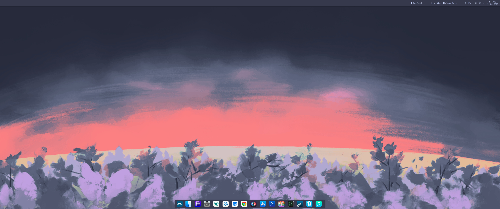
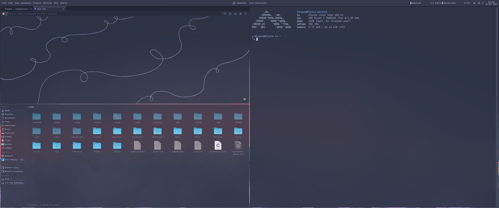
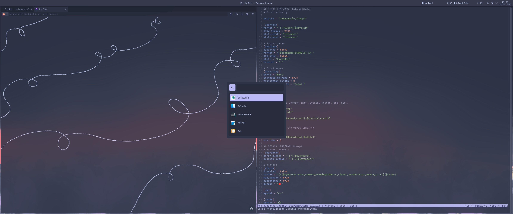
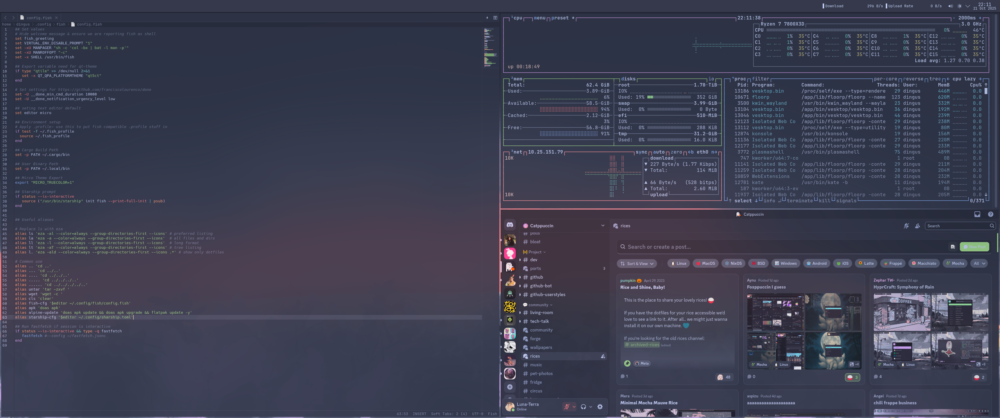

 Screenshots 

## Installation
- Install [Better Blur](https://github.com/taj-ny/kwin-effects-forceblur)
- install [PlasMusic Toolbar](https://store.kde.org/p/2088872]), [Panel Colorizer](https://store.kde.org/p/2130967), [Polonium](https://github.com/zeroxoneafour/polonium/releases/tag/nightly) and [WhiteSur Icons](https://store.kde.org/p/1405756/)
- Install the packages: fish starship fastfetch micro eza btop
- Download contents of git repo and copy everthing from the configs folder to your home directory
- Reboot your computer
- Apply the catppuccin frappe lavender colorscheme and make sure the accent color is provided by the colorscheme (This option is automaticly disabled on Endeavour OS)
- Apply the WhiteSur Dark icon theme
- Add a new command or script keyboard shortcut for the script located at ~/.config/rofi/launcher.sh
- Map the previous command to WIN+D (If after appling it does not launch rofi run: chmod =x ~/.config/rofi/launcher.sh)
- Unpin broken icons on the dock
- Change your default shell to /usr/bin/fish via chsh (Optional)
- In disable Hamburger Menu Toolbar, Main Tool Bar & Show Side bar in kate 
- In Dolphin disable Show Toolbar
- In Konsole disable Main toolbar & session toolbar

## Kde Keybinds
- Rofi = Win+d
- Dolphin = Win+e
- Floorp = Win+b
- Konsole = Win+Enter
- Close Window = Win+q
- Minimize window = Win+w
- Maximize winow = Win+f
- Change Window focused = Win+Arrow keys
- Move tiled window = Win+Shift+Arrow keys
- Resize tiled window = Win+Ctrl+Arrow Keys
- Untile/retile window = Win+Space

## Dolphin Keybinds
- Back = Crtl+a
- foward = Crtl+d

## Kate Keybinds
- Previous tab = Alt+a
- Next tab = Alt+d

## Credits
[Catppuccin](https://github.com/catppuccin)
[Jetbrains Mono](https://github.com/JetBrains/JetBrainsMono)
[Garuda Linux](https://garudalinux.org/)
[LierB](https://github.com/LierB/fastfetch/blob/master/presets/os.jsonc)
[zhaleff](https://github.com/zhaleff/hyprcraft/tree/master/Configs/.config/rofi/launcher)
